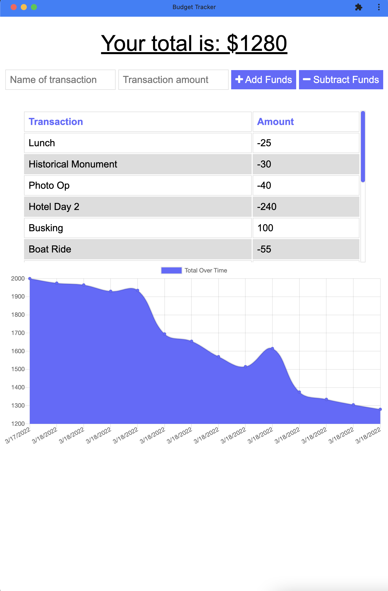

# Budget Tracker

A simple budget tracker webpage has been upgraded to a progressive web app (PWA)! This application uses service workers to store the page files in a cache for offline access, as well as uses IndexedDB to save any input made while offline, so it can automatically submit when online again without needing to be resubmitted. This page also has a manifest, so it can be installed on a user's device.

## Table of Contents
* [Live Deployment](#live-deployment)
* [Screenshot](#screenshot)
* [Installation](#installation)
* [Usage](#usage)
* [Contributing](#contributing)
* [Tests](#tests)
* [Questions](#questions)

## Live Deployment
[View the live Budget Tracker app with Heroku.](https://budget-tracker-jcolecodes.herokuapp.com/index.html)

## Screenshot


## Installation
To install and run this project, please follow these steps: 
1. Make sure you have [Node.js](https://nodejs.org) and [MongoDB](https://www.mongodb.com/try/download) installed.
2. Through the command line, go to the folder you wish this application's folder to be in.
3. Do `git clone` of the repository to get the application's files.

This program requires the following packages from npm: 
* [express](https://www.npmjs.com/package/express)
* [mongoose](https://www.npmjs.com/package/mongoose)
* [compression](https://www.npmjs.com/package/compression)
* [morgan](https://www.npmjs.com/package/morgan)

In order to install all of them, enter the following into the command line:
```
npm install
```

## Usage
To run this project, enter the following into the command line:
```
npm start
```
Then open [localhost:3001](http://localhost:3001/) to see the local webpage.

## Contributing
If you would like to contribute to this project, you can do so by:
1. Forking the project. ([Learn how to fork.](https://docs.github.com/en/get-started/quickstart/fork-a-repo))
2. Creating a new feature branch, committing the changes, and pushing the branch.
3. Opening a [Pull Request](https://github.com/JColeCodes/cash-cache/pulls).

You can also check the list of [Issues](https://github.com/JColeCodes/cash-cache/issues).

Read the [Contributor Covenant Code of Conduct](https://www.contributor-covenant.org/version/2/1/code_of_conduct/).

## Tests
This application does not have any tests written for it.

## Questions
Budget Tracker (PWA) was created by [JColeCodes](https://github.com/JColeCodes). For inquiries regarding the project, please email the creator at [capauldi@gmail.com](mailto:capauldi@gmail.com).